# 全⾯理解 JVM 虚拟机

JVM 虚拟机，这是⼀个Java 程序员⼀直以来熟悉但是⼜陌⽣的神秘东东。他是夹在 Java 代码与操作系统之间的
⼀层神秘空间。

## 为什么要学JVM？

⾸先：⾯试需要。⾯试题层出不穷，难道每次⾯试都靠背⼏百上千条⾯试⼋股？

其次：基础决定上层建筑。⾃⼰写的代码都不知道是怎么回事，怎么可能写出靠谱的系统？

然后：学习JVM也是进⾏JVM调优的基础。写的代码放到线上要如何运⾏？要配多少内存？4G够不够？线上环境出问题，服务崩溃了，怎么快速定位？怎么解决问题？

总之，学不学JVM，是能⾃主解决问题的⼀流程序员与跟着别⼈做CRUD的⼆流程序员的分⽔岭！⼆流程序员会觉得学JVM⽆关紧要，反正开发也⽤不上。做开发我只要学各种框架就⾏了。⽽⼀流程序员都在尽⾃⼰能⼒把JVM每个底层逻辑整理成⾃⼰的知识体系。

## ⼀、JVM 后⾯要学些什么-五分钟

Java发展⾄今，已经远不是⼀种语⾔，⽽是⼀个标准。只要能够写出满⾜JVM规范的class⽂件，就可以丢到JVM虚拟机执⾏。通过JVM虚拟机，屏蔽了上层各种开发语⾔的差距，同时也屏蔽了下层各种操作系统的区别。⼀次编写
，多次执⾏。

> 你有没有试过在⼀个项⽬⾥同时⽤Java和Scala进⾏开发？

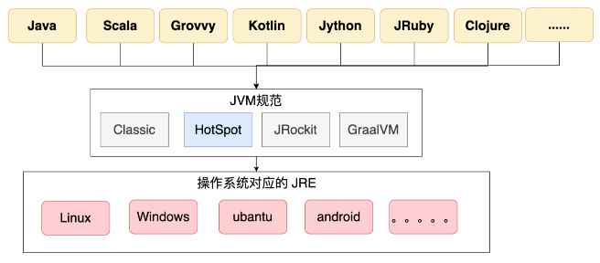

JVM也有很多具体的实现版本，现在最主流的是Oracle官⽅的HotSpot虚拟机。这也是我们课程的重点。

```bash
# java -version
java version "1.8.0_391"
Java(TM) SE Runtime Environment (build 1.8.0_391-b13)
Java HotSpot(TM) 64-Bit Server VM (build 25.391-b13, mixed mode)
```

⼀个java⽂件，整体的执⾏过程整理如下图：

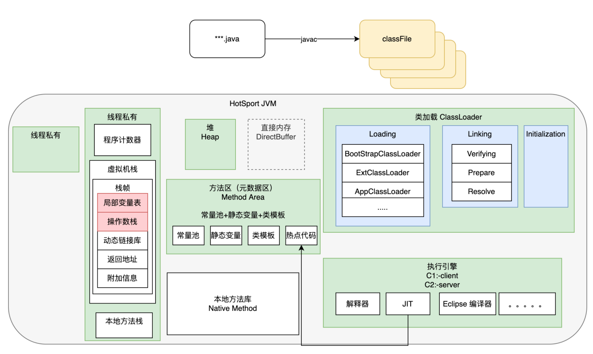

其中细节⾮常多，也很容易让⼈学得枯燥。今天主要是以实战的⽅式整体理解⼀下这些核⼼模块。在后续的课程中，会详细介绍每个部分的细节。

## ⼆、Class ⽂件规范-四⼗分钟

### 1、Class⽂件结构

实际上，我们需要了解的是，Java 官⽅实际上只定义了JVM的⼀种执⾏规范，也就是class⽂件的组织规范。理论上，只要你能够写出⼀个符合标准的class⽂件，就可以丢到
JVM 中执⾏。⾄于这个class⽂件是怎么来的，JVM 虚拟机是不管的。这也是 JVM ⽀持多语⾔的基础。

这个规范到底是什么样⼦呢？当然，你可以直接去看 Oracle 的官⽅⽂档。JDK8
的⽂档地址：https://docs.oracle.com/javase/specs/jvms/se8/html/index.html 。后⾯也会有课程带你详细分析每⼀个字节。这⾥，我们只抽取主体内容。

⾸先，我们要知道，class⽂件本质是⼀个⼆进制⽂件，虽然不能直接⽤⽂本的⽅式阅读，但是我们是可以⽤⼀些⽂本⼯具打开看看的。⽐如，对于⼀个ByteCodeInterView.class⽂件，可以⽤
UltraEdit ⼯具打开⼀个class⽂件，看到的内容部分是这样的：

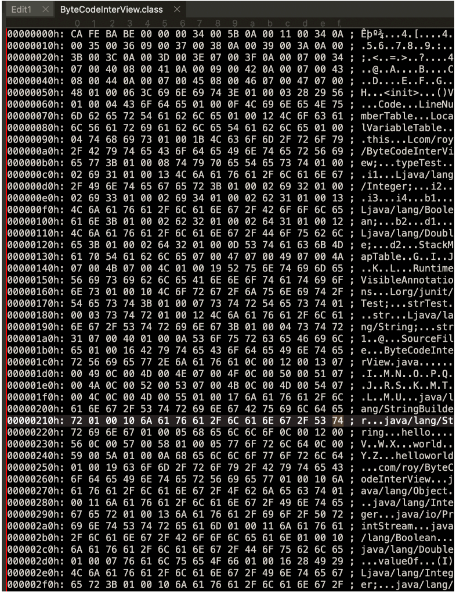

中间这⼀部分就是他的⼆进制内容。当然这是⼗六进制的表达。空格隔开的部分代表了 8 个bit，⽽每⼀位代表的是 4 个
bit字节，也就是⼀个⼗六进制的数字。例如 第⼀个字⺟ C 就表示⼗六进制的 12，⼆进制是 1100。⽽所有的class⽂件，都必须以⼗六进制的
CAFEBABE 开头，这就是 JVM 规范的⼀部分。这也解释了 Java 这个词的由
来，到底是⼀种咖啡，还是⽖哇岛。

后⾯的部分就⽐较复杂了，没法直接看。这时我们就需要⽤⼀些⼯具来看了。这样的⼯具很多。 JDK ⾃⼰就提供了⼀个 javap
指令可以直接来看⼀些class⽂件。例如可以⽤ javap -v ByteCodeInterView.class 查看到这个class⽂件的详细信息。

当然，这样还是不够直观。我们可以在 IDEA ⾥添加⼀个 ByteCodeView 插件来更直观的查看⼀个 ClassFile 的内容。看到的⼤概内容是这样的：

> 插件安装以及使⽤，这⾥就不多说了，相信对各位都是⼩菜⼀碟。

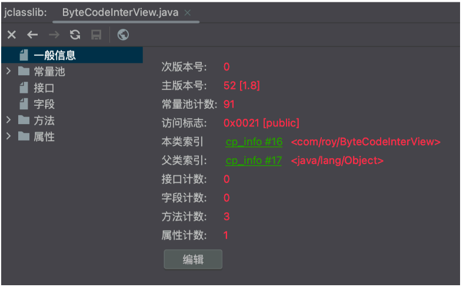

可以看到，⼀个class⽂件的⼤致组成部分。然后再结合官⽅的⽂档，或许能够让你开始对class⽂件有⼀个⼤致
的感觉。

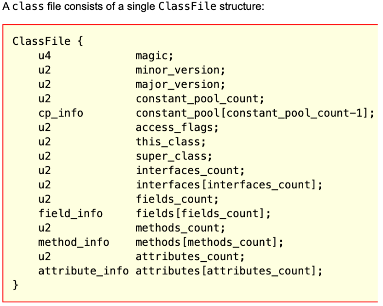

例如，前⾯u4表示四个字节是magic魔数，⽽这个魔数就是不讲道理的 CAFEBABE 。

⽽后⾯的两个u2，表示两个字节的版本号。例如我们⽤ JDK8 看我们之前的class⽂件，minor_version就是 00 00，major_version就是 00
34。换成⼆进制就是 52。52.0 这就是 JVM 给 JDK8 分配的版本号。这两个版本号就表示当前这个class⽂件是由JDK8编译出来的。后续就只能⽤8以前版本的JVM执⾏。这就是JDK版本向前兼容的基
础。

例如，如果你尝试⽤JDK8去引⽤Spring 6或者SpringBoot 3以后的新版本，就会报错。就是因为Spring 6和 SpringBoot
3发布出来的class⽂件，是⽤JDK17编译的，版本号是61。JDK8是⽆法执⾏的。

接下来，class⽂件的整体布局就⽐较明显了。其中常量池是最复杂的部分，包含了表示这个class⽂件所需要的⼏乎所有常量。⽐如接⼝名字，⽅法名字等等。⽽后⾯的⼏个部分，⽐如⽅法，接⼝等都是引⽤常量池中的各种变量。

> 详细细节，后⾯VIP课程会带你全程⼿撕。⼀个⼀个字节解读。
>
> 在这⾥，你可能会注意到⼀个不太起眼的⼩细节，常量池中的索引结构是从 1 开始的，⽽不是像 Java 中其他地⽅⼀样，从 0
> 开始。这样做的⽬的在于，如果后⾯某些指向常量池的索引值的数据在特定情况下需要表达“不引⽤任何⼀个常量池项⽬”的含义，就可以把索引值设定为
> 0 表示。

尽管 Java 发展了很多年，JDK 版本也不断更新，但是 Class ⽂件的结构、字节码指令的语义和数量⼏乎没有发⽣
过变动，所有对 Class ⽂件格式的改进，都集中在⽅法标志、属性表这些设计上原本就是可扩展的数据结构中添加
新内容。

### 2 、理解字节码指令

⽽这其中，我们重点关注的是⽅法，也就是class⽂件是如何记录我们写的这些关键代码的。例如在
ByteCodeInterView中的typeTest这个⽅法，在class⽂件中就是这样记录的：

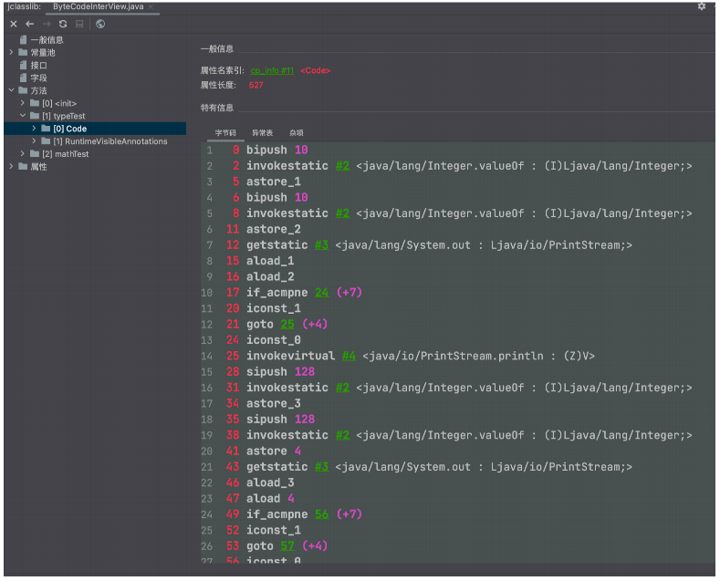

这⾥每⼀样就是⼀个字节码指令。 JVM 虚拟机的字节码指令由⼀个字节⻓度的，代表着某种特定操作含义的数字(称为操作码，OpCode)
以及跟随⽓候的零⾄多个代表此操作所需要的参数(称为操作数，Operand)
构成。其中操作数，可以是⼀个具体的参数，也可以是⼀个指向class⽂件常量池的符号引⽤，也可以是⼀个指向运⾏时常量池中的⼀个⽅法。⽐如第 0
⾏ bipush 10，操作码就是 bipush，操作数就是 10。这个指令就占据了第 0 ⾏和第 1 ⾏两⾏。⽽有些操作码，如 astore_1，就只有⼀个操作码，没有操作数。

Java 虚拟机中的操作码的⻓度只有⼀个字节(能表示的数据是0～255)，这意味着 JVM 指令集的操作码总数不超过 256
条。这些指令相⽐于庞⼤的操作系统来说，已经是⾮常⼩的了。另外其中还有很多差不多的。 ⽐如aload_1，aload_2 这些，明显就是同⼀类的指令。

这些字节码指令，在不同JDK 版本中会稍有不同。具体可以参考 Oracle 官⽅⽂档。JDK
⽂档地址： https://docs.oracle.com/javase/specs/jvms/se8/html/index.html

如果不考虑异常的话，那么 JVM 虚拟机执⾏代码的逻辑就应该是这样：

```bash

do{
    从程序计数器中读取 PC 寄存器的值 + 1；
    根据 PC 寄存器指示的位置，从字节码流中读取⼀个字节的操作码；
    if(字节码存在操作数) 从字节码流中读取对应字节的操作数；
    执⾏操作码所定义的操作；
}while(字节码流⻓度>0)
```

这些字节码指令你看不懂？没关系，⾄少现在，你可以知道你写的代码在 Class
⽂件当中是怎么记录的了。另外，如果你还想更仔细⼀点的分辨你的每⼀样代码都对应哪些指令，那么在这个⼯具中还提供了⼀个LineNumberTable，会告诉你这些指令与代码的对应关系。

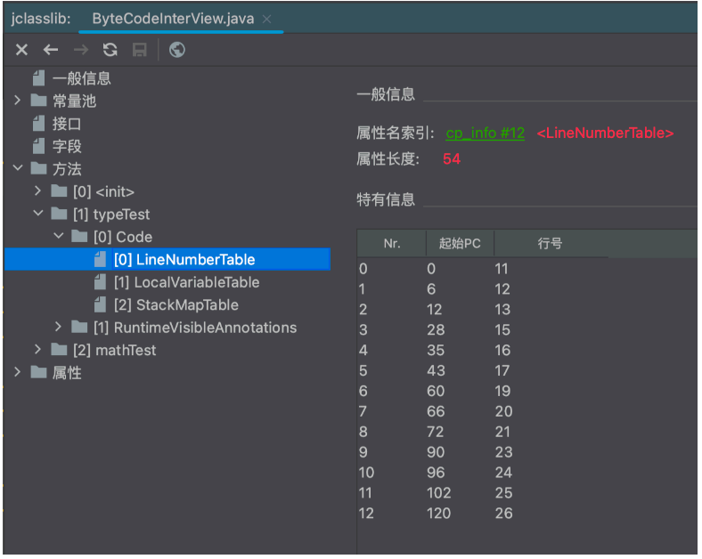

> 起始 PC 就是这些指令的字节码指令的⾏数，⾏号则对应 Java 代码中的⾏数。
>
> 实际上，Java 程序在遇到异常时给出的堆栈信息，就是通过这些数据来反馈报错⾏数的。

### 4 、字节码指令解读案例

这些字节码指令，我们后⾯有VIP课带你详细解读。但是，在这之前，你可能会有⼀个困惑。这些字节码指令是给机器看的，我要去学习这些字节码指令有什么⽤？接下来我们就来详细分析⼀个⼩案例，来看看了解字节码指令的必要性。

在ByteCodeInterView中，我们写了⼀个typeTest⽅法。我们重点来分析其中最容易让⼈产⽣困惑的⼏⾏代码。

```bash
Integer i1 = 10;
Integer i2 = 10;
System.out.println(i1 == i2);//true
Integer i3 = 128;
Integer i4 = 128;
System.out.println(i3 == i4);//false
```

执⾏结果注释在了后⾯。这些莫名其妙的true和false是怎么蹦出来的？如果你之前恰巧刷到过这样的⾯试题，或许你会记得这是因为JAVA的基础类型装箱机制引起的⼩误会。但是如果你没背过呢？或者JAVA中还有很多类似的让⼈抓狂的⾯试题，你也⼀个⼀个去背吗？那要怎么彻底了解这⼀类问题呢？你最终还是要学会⾃⼰看懂这些字节码指令。

⾸先，我们可以从LineNumberTable 中获取到这⼏⾏代码对应的字节码指令：

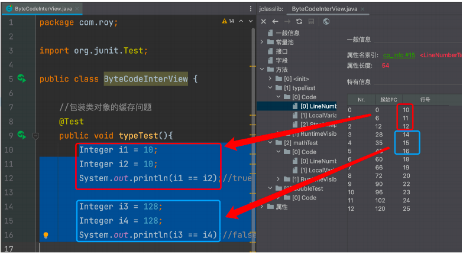

以前⾯三⾏为例，三⾏代码对应的 PC 指令就是从 0 到 12 号这⼏条指令。把指令摘抄下来是这样的：

```bash
0  bipush 10
2  invokestatic #2 <java/lang/Integer.valueOf : (I)Ljava/lang/Integer;>
5  astore_1
6  bipush 10
8  invokestatic #2 <java/lang/Integer.valueOf : (I)Ljava/lang/Integer;>
11 astore_2
12 getstatic #3 <java/lang/System.out : Ljava/io/PrintStream;>
```

可以看到，在执⾏astore指令往局部变量表中设置值之前，都调⽤了⼀次Integer.valueOf⽅法。

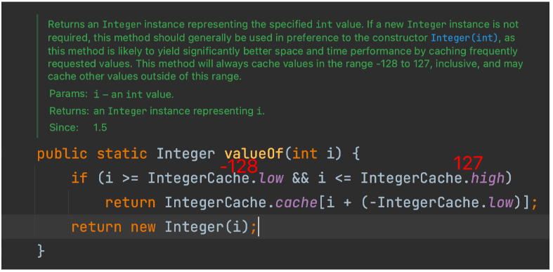

⽽在这个⽅法中，对于[-128,127]范围内常⽤的数字，实际上是构建了缓存的。每次都从缓存中获取⼀个相同的值，他们的内存地址当然就是相等的了。这些童年梦魇，是不是在这个过程中找到了终极答案？

> 实际上，你甚⾄可以使⽤反射来修改这个内部的 IntegerCache 缓存，从⽽让 Integer 的值发⽣紊乱。你有试过这样的骚操作吗？

另外，在这个过程中，我们也看到了在JVM中，是通过⼀个invokestatic指令调⽤⼀个静态⽅法。实际上JDK中还有以下⼏个跟⽅法调⽤相关的字节码指令:

- invokevirtual 指令:⽤于调⽤对象的实例⽅法，根据对象的实际类型进⾏分派(虚⽅法分派)，这也是 Java 语⾔中最常⻅的⽅法分派⽅式。
- invokeinterface 指令:⽤于调⽤接⼝⽅法，它会在运⾏时搜索⼀个实现了这个接⼝⽅法的对象，找出适合的⽅法进⾏调⽤。
- invokespecial 指令:⽤于调⽤⼀些需要特殊处理的实例⽅法，包括实例初始化⽅法私有⽅法和⽗类⽅法。
- invokestatic 指令:⽤于调⽤类静态⽅法(static ⽅法)。
- invokedynamic 指令:⽤于在运⾏时动态解析出调⽤点限定符所引⽤的⽅法。并执⾏该⽅法。前⾯四条调⽤指令的分派逻辑都固定在 Java
  虚拟机内部，⽤户⽆法改变，⽽invokedynamic指令的分派逻辑是由⽤户所设定的引导⽅法决定的。 Java 从诞⽣到现在，只增加过⼀条指令，就是invokedynamic。⾃
  JDK7 ⽀持并开始进⾏改进，这也是为 JDK8 实现Lambda表达式⽽做的技术储备。

⽅法调⽤指令与数据类型⽆关，⽽⽅法返回指令是根据返回值的类型区分的。包括ireturn(返回值是boolean
,byte,char,short,int)，lreturn, freturn, return , areturn 。另外还有⼀条return指令供声明为void的⽅法、实例初始化⽅法、类和接⼝的类初始化⽅法使⽤。。

> ⾯试题：Java 当中的静态⽅法可以被⼦类重写吗？
>
> 普通答案：不能吧，因为没⻅过这么⽤的。吧啦吧啦吧啦。。。。。我还是做个例⼦测测吧。
>
> ⾼⼿答案：不能。因为在 JVM 中，调⽤⽅法提供了⼏个不同的字节码指令。invokcvirtual 调⽤对象的虚⽅法(也就是可被⼦类重写的这些⽅法)
> 。invokespecial 根据编译时类型来调⽤实例⽅法，⽐如静态代码块(通常对应字节码层⾯的cinit ⽅法)，构造⽅法(
> 通常对应字节码层⾯的init⽅法)。invokestatic 调⽤类（静态）⽅法。 invokcinterface 调⽤接⼝⽅法。
>
>  静态⽅法和可重写的⽅法他们的调⽤指令都是不⼀样的，那么肯定是⽆法重写静态⽅法的。

### 5 、深⼊字节码理解try-cache-finally的执⾏流程

在之前解读字节码时，你们可能会注意到，在字节码指令的上⾯，有⼀个异常表的标签。这个异常表就是⽤来控制抛出异常的情况下的处理流程。我们⽤下⾯⼀个简单代码来做演示：

```java
public int inc() {
    int x;
    try {
        x = 1;
        return x;
    } catch (Exception e) {
        x = 2;
        return x;
    } finally {
        x = 3;
    }
}
```

这个⽅法编译出的字节码是这样的：

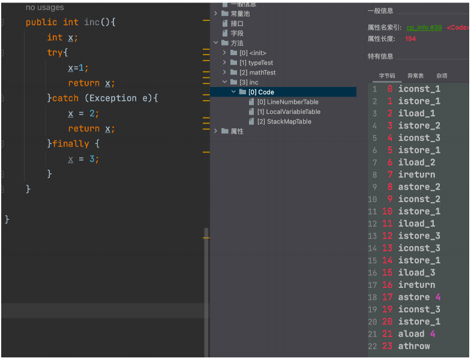

try-catch-finally的指令提现在哪⾥呢？这些就在旁边的异常表中。

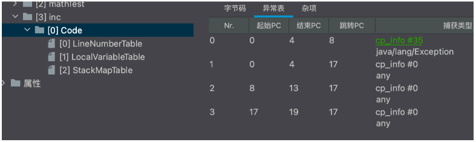

其实，对照源代码，你⼤概也应该能够猜到这个异常表的表现形式。异常表中每⼀⾏代表⼀个执⾏逻辑的分⽀。表示 当字节码从《起始 PC》到《结束
PC》(不包含结束 PC)之间出现了类型为《捕获异常》或者其⼦类的异常时，就跳转到《跳转 PC》处进⾏处理。

可以看到，这⾥定义了三条明显的执⾏路径，分别是：

- 如果try语句块中出现了属于 Exception 或者其⼦类的异常，转到catch语句块处理。
- 如果try语句块中出现了不属于 Exception 或其⼦类的异常，转到finally语句块处理。
- 如果catch语句块中出现了任何异常，转到finally语句块处理。

### 补充知识点：字节码指令是如何⼯作的？

这部分内容后⾯会有课程，在这⾥，只作为课外补充，有兴趣可以提前了解⼀下。

要了解这些指令的作⽤，就不得不先了解⼀下 JVM 中两个重要的数据结构：局部变量表和操作数栈。在 JVM
虚拟机中，会为每个线程构建⼀个线程私有的内存区域。其中包含的最重要的数据就是程序计数器和虚拟机栈。其中程序计数器主要是记录各个指令的执⾏进度，⽤于在
CPU 进⾏切换时可以还原计算结果。虚拟机栈中则包含了这个线程运⾏所需要的重要数据。

虚拟机栈是⼀个先进后出的栈结构，其中会为线程中每⼀个⽅法构建⼀个栈帧。⽽栈帧先进后出的特性也就对应了我们程序中每个⽅法的执⾏顺序。每个栈帧中包含四个部分，局部变量表，操作数栈，动态链接库、返回地址。

- 操作数栈是⼀个先进后出的栈结构，主要负责存储计算过程中的中间变量。操作数栈中的每⼀个元素都可以是包括long型和double在内的任意
  Java 数据类型。

- 局部变量表可以认为是⼀个数组结构，主要负责存储计算结果。存放⽅法参数和⽅法内部定义的局部变量。以 Slot 为最⼩单位。

- 动态链接库主要存储⼀些指向运⾏时常量池的⽅法引⽤。每个栈帧中都会包含⼀个指向运⾏时常量池中该栈帧所属⽅法的应⽤，持有这个引⽤是为了⽀持⽅法动态调⽤过程中的动态链接。

- 返回地址存放调⽤当前⽅法的指令地址。⼀个⽅法有两种退出⽅式，⼀种是正常退出，⼀种是抛异常退出。如果⽅法正常退出，这个返回地址就记录下⼀条指令的地址。如果是抛出异常退出，返回地址就会通过异常表来确定。

- 附加信息主要存放⼀些 HotSpot 虚拟机实现时需要填⼊的⼀些补充信息。这部分信息不在 JVM 规范要求之内，由各种虚拟机实现⾃⾏决定。

其中最为重要的就是操作数栈和局部变量表了。例如，对于初学者最头疼的++操作，下⾯的 mathTest ⽅法

```java
public int mathTest() {
    int k = 1;
    k = k++;
    return k;
}
```

我们都知道k的返回结果是 1，但是++⾃增操作到底有没有执⾏呢？就可以按照指令这样进⾏解释：

```bash
0 iconst_1 //往操作数栈中压⼊⼀个常量1
1 istore_1 // 将 int 类型值从操作数栈中移出到局部变量表1 位置
2 iload_1 // 从局部变量表1 位置装载int 类型的值到操作数栈中
3 iinc 1 by 1 // 将局部变量表 1 位置的数字增加 1
6 istore_1 // 将int类型值从操作数栈中移出到局部变量表1 位置
7 iload_1 // 从局部变量表1 位置装载int 类型的值到操作数栈中
8 ireturn // 从操作数栈顶，返回 int 类型的值
```

这个过程中，k++是在局部变量表中对数字进⾏了⾃增，此时栈中还是
1。接下来执⾏=操作，就对应⼀个istore指令，从栈中将数字装载到局部变量表中。局部变量表中的k的值(对应索引 1 位置)，就还是还原成了
1。

那么接下来，你是不是可以⾃⾏理解⼀下 k=++k，是怎么执⾏的呢？

另外，这⾥补充⼀个在互联⽹⼤⼚的⾼级职位⾯试过程中被问到过的细节问题：

如何确定⼀个⽅法需要多⼤的操作数栈和局部变量？

实际上，每个⽅法在执⾏前都需要申请对应的资源，主要是内存。如果内存空间不够，就要在执⾏前直接抛出异常，⽽不能等到执⾏过程中才发现要⽤的内存空间申请不下来。

有些⾯试时，是会给你⼀个具体的⽅法，让你⾃⼰⼀下计算过程中需要⼏个操作数栈和⼏个局部变量。这是对算法的基础要求。但是在⼯作中，其实class⽂件当中就记录了所需要的操作数栈深度和局部变量表的槽位数。例如对于
mathTest⽅法，所需的资源在⼯具中的纪录是这样的：

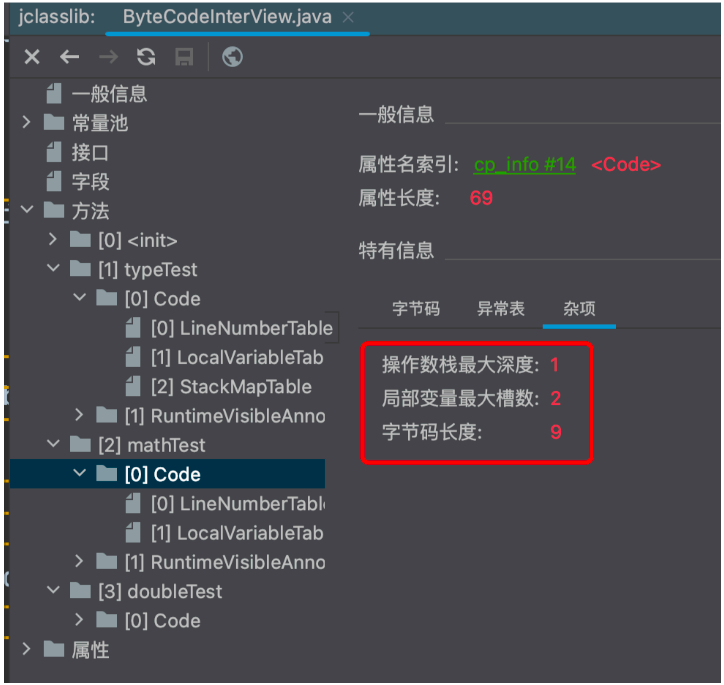

这⾥会有⼀个⼩问题，如果你⾃⼰推演过刚才的计算过程，可以看到，局部变量表中，明明只⽤到了索引为 1 的⼀个位置⽽已，为什么局部变量表的最⼤槽数是
2 呢？

这是因为对于⾮静态⽅法，JVM 默认都会在局部变量表的 0 号索引位置放⼊this变量，指向对象⾃身。所以我们可以在代码中⽤this访问⾃⼰的属性。

⼀个槽可以存放 Java 虚拟机的基本数据类型，对象引⽤类型和returnAddress类型

## 三、类加载-⼆⼗分钟

Class⽂件中已经定义好了⼀个Java程序执⾏的全部过程，接下来就是要扔到JVM中执⾏。既然要执⾏，就少不了类加载的模块。⽽好玩的是，类加载模块是少数⼏个可以在Java代码中扩展的JVM底层功能。

类加载模块在JDK8之后，发⽣了⾮常重⼤的变化。后续以JDK8为主。JDK8以后的类加载功能，会在后续课程中介绍。

### 1 、JDK8的类加载体系

有了 Class ⽂件之后，接下来就需要通过类加载模块将这些 Class ⽂件加载到 JVM 内存当中，这样才能执⾏。⽽关于类加载模块，以 JDK8
为例，最为重要的内容我总结为三点：

- 每个类加载器对加载过的类保持⼀个缓存。
- 双亲委派机制，即向上委托查找，向下委托加载。
- 沙箱保护机制。

### 2、双亲委派机制

JDK8中的类加载器都继承于⼀个统⼀的抽象类ClassLoader，类加载的核⼼也在这个⽗类中。其中，加载类的核⼼⽅法如下：

```java
//类加载器的核⼼⽅法
protected Class<?> loadClass(String name, boolean resolve)
        throws ClassNotFoundException {
    synchronized (getClassLoadingLock(name)) {
// 每个类加载起对他加载过的类都有⼀个缓存，先去缓存中查看有没有加载过
        Class<?> c = findLoadedClass(name);
        if (c == null) {】
            //没有加载过，就⾛双亲委派，找⽗类加载器进⾏加载。
            long t0 = System.nanoTime();
            try {
                if (parent != null) {
                    c = parent.loadClass(name, false);
                } else {
                    c = findBootstrapClassOrNull(name);
                }
            } catch (ClassNotFoundException e) {
            }
            if (c == null) {
                long t1 = System.nanoTime();
                // ⽗类加载起没有加载过，就⾃⾏解析class⽂件加载。
                c = findClass(name);
                sun.misc.PerfCounter.getParentDelegationTime().addTime(t1 - t0);
                sun.misc.PerfCounter.getFindClassTime().addElapsedTimeFrom(t1);
                sun.misc.PerfCounter.getFindClasses().increment();
            }
        }
        //这⼀段就是加载过程中的链接Linking部分，分为验证、准备，解析三个部分。
        // 运⾏时加载类，默认是⽆法进⾏链接步骤的。
        if (resolve) {
            resolveClass(c);
        }
        return c;
    }
}
```

这个⽅法⾥，就是最为核⼼的双亲委派机制。

并且，这个⽅法是protected声明的，意味着，是可以被⼦类覆盖的，所以，双亲委派机制也是可以被打破的。

> 为什么要打破双亲委派呢？想想Tomcat要如何加载webapps⽬录下的多个不同的应⽤？
>
> ⽽关于类加载机制的所有有趣的玩法，也都在这个核⼼⽅法⾥。⽐如class⽂件加密加载，热加载等。

### 3、沙箱保护机制

双亲委派机制有⼀个最⼤的作⽤就是要保护JDK内部的核⼼类不会被应⽤覆盖。⽽为了保护JDK内部的核⼼类，JAVA在双亲委派的基础上，还加了⼀层保险。就是ClassLoader中的下⾯这个⽅法。

```java
private ProtectionDomain preDefineClass(String name,
                                        ProtectionDomain pd) {
    if (!checkName(name))
        throw new NoClassDefFoundError("IllegalName: " + name);
// 不允许加载核⼼类
    if ((name != null) && name.startsWith("java.")) {
        throw new SecurityException
                ("Prohibited package name: " +
                        name.substring(0, name.lastIndexOf('.')));
    }
    if (pd == null) {
        pd = defaultDomain;
    }
    if (name != null) checkCerts(name, pd.getCodeSource());
    return pd;
}
```

这个⽅法会⽤在JAVA在内部定义⼀个类之前。这种简单粗暴的处理⽅式，当然是有很多时代的因素。也因此在JDK中，你可以看到很多javax开头的包。这个奇怪的包名也是跟这个沙箱保护机制有关系的。

### 4、类和对象有什么关系

通过类加载模块，我们写的class⽂件就可以加载到JVM当中。但是类加载模块针对的都是类，⽽我们写的java程序都是基于对象来执⾏。类只是创建对象的模板。那么类和对象倒是什么关系呢？

⾸先：类 Class 在 JVM 中的作⽤其实就是⼀个创建对象的模板。也就是说他的作⽤更多的体现在创建对象的过程当中。⽽在程序具体执⾏的过程中，主要是围绕对象在进⾏，这时候类的作⽤就不⼤了。因此，在
JVM 中，类并不直接保存在最宝贵最核⼼的堆内存当中，⽽是挪到了堆内存以外的⼀部分内存中。这部分内存，在 JDK8 以前被成为永久带PermSpace，⽽在
JDK8 之后被改为了元空间 MetaSpace。

#### 补充

堆空间可以理解为JVM的客厅，所有重要的事情都在客厅处理。元空间可以理解为JVM的库房，东⻄扔进去基本上就很少管了。

这个元空间逻辑上可以认为是堆空间的⼀部分，但是他跟堆空间有不同的配置参数，不同的管理⽅式。因此也可以看成是单独的⼀块内存。这⼀块内存就相当于家⾥的⼯具间或者地下室，都是放⼀些⽤得⽐较少的东⻄。最主要就是类的⼀些相关信息，⽐如类的元数据、版本信息、注解信息、依赖关系等等。

元空间可以通过-XX:MetaspaceSize 和 -XX:MaxMetaspaceSize参数设置⼤⼩。但是⼤部分情况下，你是不需要管理元空间⼤⼩的，JVM 会动态进⾏分配。

另外，这个元空间也是会进⾏ GC
垃圾回收的。如果⼀个类不再使⽤了，JVM就会将这个类信息从元空间中删除。但是，显然，对类的回收效率是很低的。只有⼀些⾃定义类加载器⾃⾏加载的⼀些类有被回收的可能，⼤部分情况下，类是不会被回收的。所以堆元空间的垃圾回收基本上是很少有效果的。⼤部分情况下，我们是不需要管元空间的。除⾮你的JVM
内存确实⾮常紧张，这时可以设定 -XX:MaxMetaspaceSize参数，严格控制元空间⼤⼩。

<hr>

然后：在我们创建的每⼀个对象中，JVM也会保存对应的类信息。

在堆中，每⼀个对象的头部，还会保存这个对象的类指针(classpoint)
，指向元空间中的类。这样我们就可以通过⼀个对象的getClass⽅法获取到对象所属的类了。这个类指针，我们也是可以通过⼀个⼩⼯具观察到的。

例如，下⾯这个 Maven依赖就可以帮我们分析⼀个对象在堆中保存的信息。

```xml

<dependency>
    <groupId>org.openjdk.jol</groupId>
    <artifactId>jol-core</artifactId>
    <version>0.17</version>
</dependency>
```

然后可以⽤以下⽅法简单查看⼀下对象的内存信息。

```java
public class JOLDemo {
    private String id;
    private String name;

    public static void main(String[] args) {
        JOLDemo o = new JOLDemo();
        System.out.println(ClassLayout.parseInstance(o).toPrintable());
        synchronized (o) {
            System.out.println(ClassLayout.parseInstance(o).toPrintable());
        }
    }
}
```

看到的结果⼤概是这样：

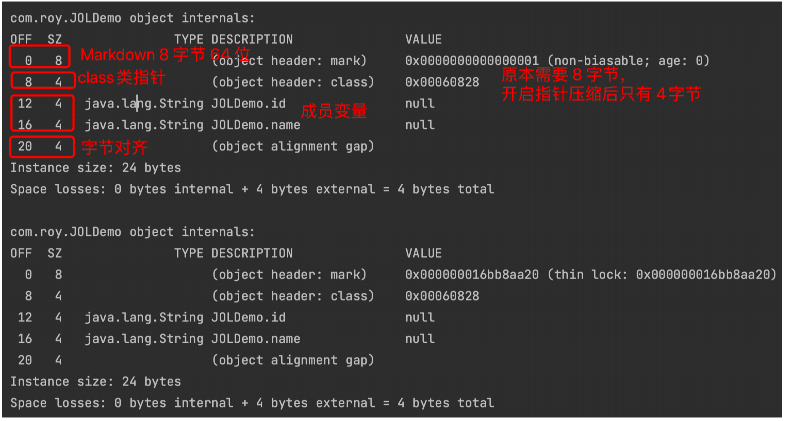

这⾥ClassPoint 实际上就是⼀个指向元空间对应类的⼀个指针。当然，具体结果是被压缩过的。

另外Markdown标志位就是对象的⼀些状态信息。包括对象的 HashCode，锁状态，GC分代年龄等等。

> 这⾥⾯锁机制是⾯试最喜欢问的地⽅。⽆锁、偏向锁(新版本 JDK 中已经废除)、轻量级锁、重量级锁这些东
> ⻄，都是在Markdown中记录的。

## 四、执⾏引擎-五分钟

之前已经看到过，在 Class ⽂件当中，已经明确的定义清楚了程序的完整执⾏逻辑。⽽执⾏引擎就是将这些字节
指令转为机器指令去执⾏了。这⼀块更多的是跟操作系统打交道，对开发⼯作其实帮助就不是很⼤了。所以，如果
不是专⻔研究语⾔，执⾏引擎这⼀块就没有必要研究太深了。

### 1、解释执⾏与编译执⾏

JVM 中有两种执⾏的⽅式：

- 解释执⾏就相当于是同声传译。JVM 接收⼀条指令，就将这条指令翻译成机器指令执⾏。
- 编译执⾏就相当于是提前翻译。好⽐领导发⾔前就将讲话稿提前翻译成对应的⽂本，上台讲话时就可以照着念了。编译执⾏也就是传说中的
  JIT 。

⼤部分情况下，使⽤编译执⾏的⽅式显然⽐解释执⾏更快，减少了翻译机器指令的性能消耗。⽽我们常⽤的
HotSpot 虚拟机，最为核⼼的实现机制就是这个 HotSpot 热点。他会搜集⽤户代码中执⾏最频繁的热点代码，形
成CodeCache，放到元空间中，后续再执⾏就不⽤编译，直接执⾏就可以了。

但是编译执⾏起始也有⼀个问题，那就是程序预热会⽐较慢。毕竟作为虚拟机，你不可能提前预知到程序员要写
⼀些什么稀奇古怪的代码，也就不可能把所有代码都提前编译成模板。⽽将执⾏频率并不⾼的代码也编译保存下
来，也是得不偿失的。所以，现在JDK 默认采⽤的就是⼀种混合执⾏的⽅式。他会⾃⼰检测采⽤那种⽅式执⾏更
快。虽然你可以⼲预 JDK 的执⾏⽅式，但是在绝⼤部分情况下，都是不需要进⾏⼲预的。

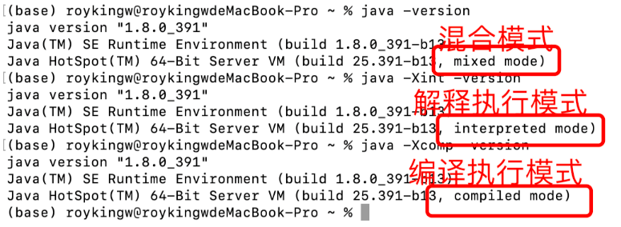

另外，现在也有⼀种提前编译模式，AOT 。可以直接将Java 程序编译成机器码。⽐如GraalVM，可以直接将 Java 程序编译成可执⾏⽂件，这样就不需要
JVM 虚拟机也能直接在操作系统上执⾏。

关于 AOT 是不是会⼀统天下，也是现在⾯试中⽐较喜欢问的问题。虽然在 SpringBoot3 等框架中已经有
了落地，但是从⽬前来看，AOT还远没有成为主流，离⼀统天下还有点距离。

少了 JVM 这个中间商之后，虽然⼤部分情况下是可以提升程序执⾏性能的，但是，也并不是就完美⽆缺
了。毕竟很显然，这种⽅式其实是以丧失⼀定的跨平台特性作为代价的。

要注意，⽬前 AOT 这种⽅式还是不太安全的。毕竟 JVM 打了这么多年的怪，什么⽜⻤蛇神都⻅多了。现
在 AOT 要绕开 JVM，那么这些怪就都要⾃⼰去打了。中间有个什么疏忽，那是难免的。

### 2、编译执⾏时的代码优化

热点代码会触发 JIT 实时编译，⽽JIT 编译运⽤了⼀些经典的编译优化技术来实现代码的优化，可以智能地编译
出运⾏时的最优性能代码。

HotSpot虚拟机中内置了两个（或三个）即时编译器，其中有两个编译器存在已久，分别被称为“客户端编译器”
（Client Compiler）和“服务端编译器”（Server Compiler），或者简称为C1编译器和C2编译器（部分资料和JDK
源码中C2也叫Opto编译器），第三个是在JDK 10时才出现的、⻓期⽬标是代替C2的Graal编译器。Graal编译器采
⽤ Java 语⾔编写，因此⽣态的活⼒更强。并由此衍⽣出了 GraalVM 这样的⽀持实时编译的产品。也就是绕过
Class ⽂件，直接将 Java 代码编译成可在操作系统本地执⾏的应⽤程序。这也就是 AOT 技术Ahead Of Time。

C1 会对字节码进⾏简单和可靠的优化，耗时短，以达到更快的编译速度。启动快，占⽤内存⼩，执⾏效率没有
server快。默认情况下不进⾏动态编译，适⽤于桌⾯应⽤程序。

C2 进⾏耗时较⻓的优化，以及激进优化，但优化的代码执⾏效率更⾼。启动慢，占⽤内存多，执⾏效率⾼，适
⽤于服务器端应⽤。 默认情况下就是使⽤的 C2 编译器。并且，绝⼤部分情况下也不建议特意去使⽤ C1。

由于即时编译器编译本地代码需要占⽤程序运⾏时间，通常要编译出优化程度越⾼的代码，所花费的时间便会
越⻓；⽽且想要编译出优化程度更⾼的代码，解释器可能还要替编译器收集性能监控信息，这对解释执⾏阶段的速
度也有所影响。为了在程序启动响应速度与运⾏效率之间达到最佳平衡，HotSpot虚拟机在编译⼦系统中加⼊了分
层编译的功能，分层编译根据编译器编译、优化的规模与耗时，划分出不同的编译层次，其中包括：

- 第0层。程序纯解释执⾏，并且解释器不开启性能监控功能（Profiling）。
- 第1层。使⽤C1编译器将字节码编译为本地代码来运⾏，进⾏简单可靠的稳定优化，不开启性能监控功能。
- 第2层。仍然使⽤C1编译器执⾏，仅开启⽅法及回边次数统计等有限的性能监控功能。
- 第3层。仍然使⽤C1编译器执⾏，开启全部性能监控，除了第2层的统计信息外，还会收集如分⽀跳转、虚⽅法调⽤版本等全部的统计信息。
- 第4层。使⽤C2编译器将字节码编译为本地代码，相⽐起C1编译器，C2编译器会启⽤更多编译耗时更⻓的优化，还会根据性能监控信息进⾏⼀些不可靠的激进优化。

JDK8 中提供了参数 -XX:TieredStopAtLevel=1 可以指定使⽤哪⼀层编译模型。但是，除⾮你是JVM 的开发者，
否则不建议⼲预 JVM 的编译过程。

### 3、静态执⾏与动态执⾏

静态执⾏指在 Class ⽂件编译过程中就已经确定了执⾏⽅法。 动态执⾏指需要在运⾏期间才能确定调⽤哪个⽅
法。⽐如多个重载的⽅法，需要根据传⼊类型确定调⽤哪个⽅法。

动态执⾏更多的是关联到invokedynamic指令。在JVM的语⾔体系中，以Scala为代表的函数式的编程⽅式会越来
越重要，到时候动态执⾏也会随之变得更为重要。

## 五、GC 垃圾回收-三⼗分钟

执⾏引擎会将class⽂件扔到JVM的内存当中运⾏。在运⾏过程中，需要不断的在内存当中创建并销毁对象。在传
统C/C++语⾔中，这些销毁的对象需要⼿动进⾏内存回收，防⽌内存泄漏。⽽在Java当中，实现了影响深远的GC垃
圾回收机制。

GC 垃圾⾃动回收，这个可以说是 JVM 最为标志性的功能。不管是做性能调优，还是⼯作⾯试，GC 都是 JVM 部
分的重中之重。⽽对于 JVM 本身，GC 也是不断进⾏设计以及优化的核⼼。⼏乎 Java 提出的每个版本都对 GC 有或
⼤或⼩的改动。这⾥，我就⽤⽬前还是⽤得做多的 JDK8，带⼤家快速梳理⼀下 GC 部分的主线。

### 1 、垃圾回收器是⼲什么的

在了解 JVM之前，给⼤家推荐⼀个⼯具，阿⾥开源的 Arthas 。官⽹地址：https://arthas.aliyun.com/ 。 这个
⼯具功能⾮常强⼤，是对 Java进程进⾏性能调优的⼀个⾮常重要的⼯具，对于了解 JVM 底层帮助也⾮常⼤。

> 具体使⽤⽅式参照官⽅⽂档。

我们先运⾏⼀个简单的 Java 程序：

```java
public class GCTest {
    public static void main(String[] args) throws InterruptedException {
        List l = new ArrayList<>();
        for (int i = 0; i < 100_0000; i++) {
            l.add(new String("dddddddddddd"));
            Thread.sleep(100);
        }
    }
}
```

运⾏后，使⽤Arthas 的dashboard指令，可以查看到这个 Java 程序的运⾏情况。

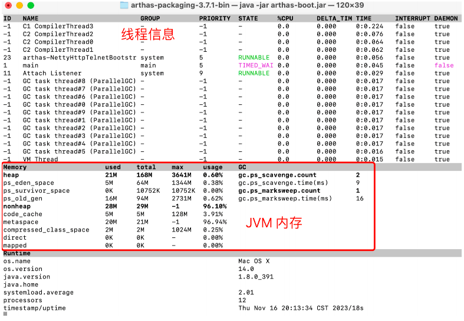

重点关注中间的 Memory 部分，这⼀部分就是记录的 JVM 的内存使⽤情况。⽽后⾯的 GC 部分就是垃圾回收的
执⾏情况。我们就从这些能看到的部分作为⼊⼝，来理解⼀下⼀个 Java 进程是怎么管理他的内存的。

从 Memory 部分可以看到，⼀个 Java 进程会将他管理的内存分为heap堆区和nonheap⾮堆区两个部分。其中
⾮堆区的⼏个核⼼部分像code_cache(热点指令缓存)，metaspace(元空间),compressed_class_space(压缩类空间)
我们之前都接触到了。这⼀部分就相当于 Java 进程中的地下室，属于不太活跃的部分。⽽中间heap堆区就相当于
客厅了，属于Java 中最为核⼼的部分。⽽这其中，⼜⼤体分为了eden_space，survivor_space和old_gen三个⼤的
部分，这就是 JVM 内存的主体。我们之前分析的栈区，这⾥没有列出。

整体内存布局如下图：

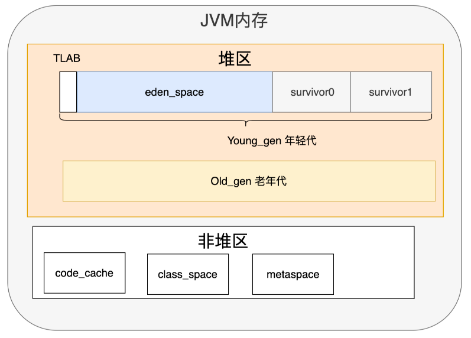

其中堆区是 JVM 核⼼的存放对象的内存区域。他的⼤⼩可以由参数 -Xms(初始堆内存⼤⼩)，-Xmx(最⼤堆内存)
参数指令。从这两个参数可以看到，堆内存是可以扩展的。如果初始内存不够，JVM 会扩⼤堆内存。但是如果内存
扩展到了最⼤堆内存时还不够。这时就⽆法继续扩展了，⽽是会抛出 OOM 异常。这两个参数在⽣产环境中最好设
置成⼀样，减少内存扩展时的性能消耗。

⽽GC垃圾回收器，就是要对这些内存空间进⾏及时回收，从⽽让这些内存可以重复利⽤。

### 2、分代收集模型

不同GC，对内存的管理和回收的⽅式都是不同的。但是这其中⾯试最喜欢问的，就是关于垃圾分代收集模型。

在Memor部分还可以看到多次出现了 ps_ 这样的字样。这其实就代表JDK8默认的垃圾回收器Parallel
Scavenge。

其整体的⼯作机制如下图：

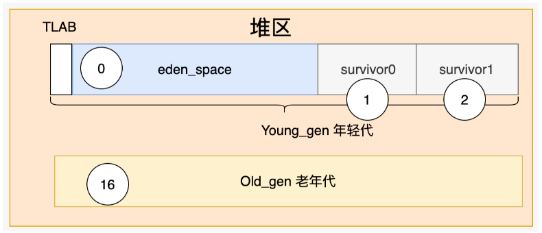

JAVA做过统计，80%的对象都是“朝⽣夕死”。这些对象，被集中放在了⼀块⽐较⼩的内存空间当中，快速创建，
快速回收，这块内存区域就是年轻代。在年轻代会⾮常频繁的进⾏垃圾回收，称为YoungGC。⽽年轻代⼜会被进⼀
步划分为⼀个eden_space和两个survivor。这三个区域的⼤⼩⽐例默认是 8:1:1。

另外少部分需要⻓期使⽤的对象，被放到另⼀块竞争没有那么激烈的对象，则被放到另外⼀块⽐较⼤的内存空间
当中，⻓期保持，这块内存就是⽼年代。在⽼年代，垃圾回收的频率则会相对⽐较低，只有空间不够时才进⾏，称
为OldGC。

年轻代与⽼年代默认的⼤⼩⽐例是 1:2。

常⻅的分代收集模型中，对象会优先在eden区创建，经过⼀次YoungGC后，如果没有被回收，就会被移动到⼀
个survivor区。接下来，下⼀次YoungGC时，⼜会被移动到另⼀块Survivor区。每移动⼀次，记录⼀个分代年龄。
直到分代年龄太⼤了(默认是16)，就会被移动到⽼年代。到⽼年代后，对象就不再记录分代年龄了，在⽼年代安安
静静的⽤到退休。

这就是JDK最有代表性的分代年龄收集机制。通过分代收集机制，JVM可以对不同的对象采取不同的回收策略，
从⽽提⾼垃圾回收的效率。

#### 补充

当然，分代收集机制在具体实现过程中，还需要根据具体情况提供更多优化机制。后续会带⼤家详细了解。

⽐如，如果⼩ O 占⽤内存⾮常⼩，那么在创建⼩ O 时，JVM 会在Eden_space中单独划分出⼀⼩⽚线程专属
的内存空间，称为 TLAB 。⼩ O 就在 TLAB 中创建。由于 TLAB 空间是线程私有的，所以就可以避免多个线
程之间的资源争抢。

另外，如果⼩ O 占⽤的内存⾮常⼤，Eden_space都装不下。这时⼩ O 就会跳过年轻代，直接进⼊⽼年代。

### 3 、JVM中有哪些垃圾回收器？

java 从诞⽣到现在最新的 JDK21 版本，总共就产⽣了以下⼗个垃圾回收器

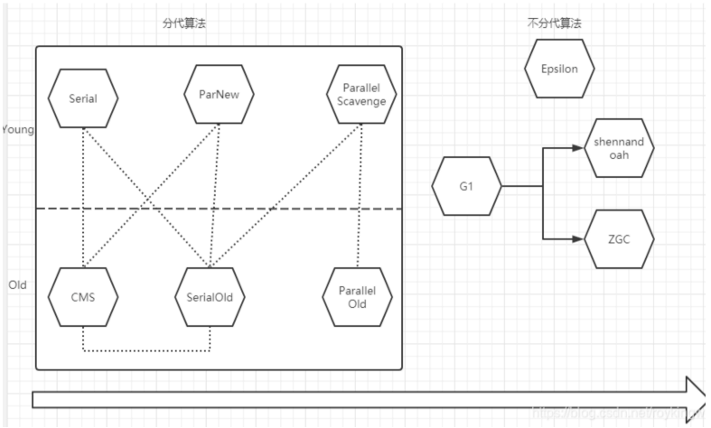

其中，左边的都是分代算法。也就是将内存划分为年轻代和⽼年代进⾏管理。⽽有虚线的部分表示可以协同进⾏
⼯作。JDK8默认就是使⽤的Parallel Scavenge和Parallel Old的组合。也就是在arthas的dashboard中看到的ps。

右侧的是不分代算法。也就是不再将内存严格划分位年轻代和⽼年代。JDK9 开始默认使⽤ G1。⽽ ZGC是⽬前最
先进的垃圾回收器。shennandoah则是OpenJDK 中引⼊的新⼀代垃圾回收器，与 ZGC 是竞品关系。Epsilon是⼀
个测试⽤的垃圾回收器，根本不⼲活。

> 关于垃圾回收器的细节，后续的VIP课程会详细分析。

## 六、 GC 情况分析实例-⼗分钟

关于各个垃圾回收器的细节，后⾯的课程会做更深⼊的分享。这⾥我们只关⼼GC和开发⼯作的关系。GC可以说
是决定JAVA程序运⾏效率的关键。因此我们⼀定要学会定制GC参数，以及分析GC⽇志。

### 1、如何定制GC运⾏参数

在现阶段，各种GC垃圾回收器都只适合⼀个特定的场景，因此，我们也需要根据业务场景，定制合理的GC运⾏
参数。

另外，JAVA程序在运⾏过程中要处理的问题是层出不穷的。项⽬运⾏期间会⾯临各种各样稀奇古怪的问题。⽐如
CPU 超⾼，FullGC 过于频繁，时不时的 OOM 异常等等。这些问题⼤部分情况下都只能凭经验进⾏深⼊分析，才
能做出针对性的解决。

如何定制JVM运⾏参数呢？⾸先我们要知道有哪些参数可以供我们选择。

关于 JVM 的参数，JVM 提供了三类参数。

⼀类是标准参数，以-开头，所有 HotSpot 都⽀持。例如java -version。这类参数可以使⽤java -help 或者java -?
全部打印出来

⼆类是⾮标准参数，以-X 开头，是特定 HotSpot版本⽀持的指令。例如java -Xms200M -Xmx200M。这类指令
可以⽤java -X 全部打印出来。

最后⼀类，不稳定参数，这也是 JVM调优的噩梦。以-XX 开头，这些参数是跟特定HotSpot版本对应的，很有可
能换个版本就没有了。详细的⽂档资料也特别少。JDK8 中的以下⼏个指令可以帮助开发者了解 JDK8 中的这⼀类不
稳定参数。

```bash
java -XX:+PrintFlagsFinal:所有最终⽣效的不稳定指令。
java -XX:+PrintFlagsInitial:默认的不稳定指令
java -XX:+PrintCommandLineFlags:当前命令的不稳定指令 --这⾥可以看到是⽤的哪种GC。 JDK1.8默认⽤的ParallelGC
```

### 2、打印GC⽇志

有了⼿段之后，我们最主要的就是要能快速发现问题。

对 JVM 虚拟机来说，绝⼤多数的问题往往都跟堆内存的 GC 回收有关。因此下⾯⼏个跟 GC 相关的⽇志打印参数
是必须了解的。这通常也是进⾏ JVM 调优的基础。

-XX:+PrintGC: 打印GC信息 类似于-verbose:gc

-XX:+PrintGCDetails: 打印GC详细信息，这⾥主要是⽤来观察FGC的频率以及内存清理效率。

-XX:+PrintGCTimeStamps 配合 -XX:+PrintGC使⽤。在 GC 中打印时间戳。

-XX:PrintHeapAtGC: 打印GC前后的堆栈信息

-Xloggc:filename : GC⽇志打印⽂件。

> 不同 JDK 版本会有不同的参数。 ⽐如 JDK9 中，就不⽤分这么多参数了，可以统⼀使⽤-X-log:gc* 通配符打印所有的 GC ⽇志。

例如下⾯⼀个简单的示例代码：

```java
public class GcLogTest {
    public static void main(String[] args) {
        ArrayList<byte[]> list = new ArrayList<>();
        for (int i = 0; i < 500; i++) {
            byte[] arr = new byte[1024 * 100];//100KB
            list.add(arr);
            try {
                Thread.sleep(10);
            } catch (InterruptedException e) {
                e.printStackTrace();
            }
        }
    }
}
```

然后在执⾏这个⽅法时，添加以下 JVM 参数：

```bash
-Xms60m -Xmx60m -XX:SurvivorRatio=8 -XX:+PrintGCDetails
```

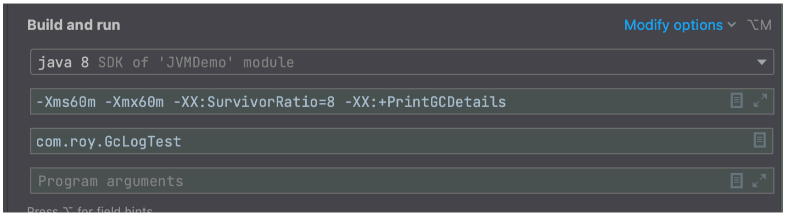

执⾏后，可以看到类似这样的输出信息。

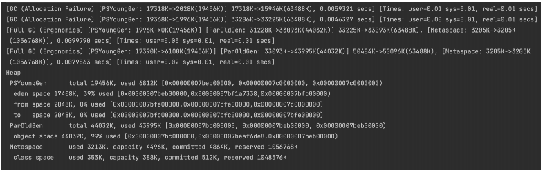

这⾥⾯就记录了两次 MinorGC 和两次 FullGC 的执⾏效果。另外，在程序执⾏完成后，也会打印出 Heap 堆区的
内存使⽤情况。

当然，⽬前这些⽇志信息只是打印在控制台，你只能凭经验⾃⼰强⾏去看。接下来，就可以添加-Xloggc参数，
将⽇志打印到⽂件⾥。然后拿⽇志⽂件进⾏整体分析。

### 3、GC⽇志分析

这些GC⽇志隐藏了项⽬运⾏⾮常多隐蔽的问题，要如何发现其中的这些潜在的问题呢？

这⾥推荐⼀个开源⽹站 https://www.gceasy.io/ 这是国外⼀个开源的GC ⽇志分析⽹站。你可以把 GC ⽇志⽂件
直接上传到这个⽹站上，他就会分析出⽇志⽂件中的详细情况。


> 这是个收费⽹站，但是有免费使⽤的额度。

例如，在我们之前的示例中，添加⼀个参数 -Xloggc:./gc.log ，就可以将GC⽇志打印到⽂件当中。接下来就可以
将⽇志⽂件直接上传到这个⽹站上。⽹站就会帮我们对GC情况进⾏分析。示例⽂件得到的报告是这样的：

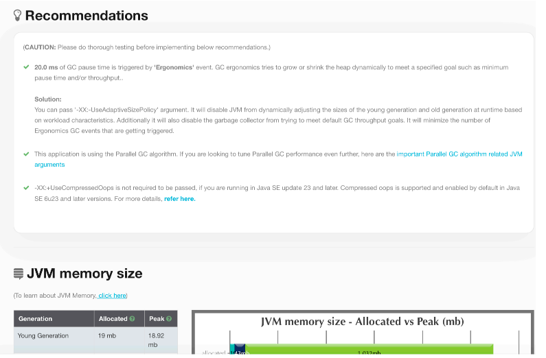

通过这个报告，可以及时发现项⽬运⾏可能出现的⼀些隐藏问题。并且这个报告也提供了⼀些具体的修改意⻅。
当然，如果你觉得这些建议还不够满意，那么报告中还提供了⾮常详细的指标分析，通过这些指标，你可以进⼀步
的分析问题，寻找新的改进⽅向。

如果是你们⾃⼰开发的项⽬，那么接下来，根据这些建议和数据，做进⼀步的分析，调整参数，优化配置。到这
⾥，恭喜你，架构师的绝活-JVM调优，你就算是正式⼊⻔了。

## 章节总结

聊到这⾥，你对于 JVM 是不是开始有⼀点感觉了？在这个过程当中，你是不是还有很多细节⽅⾯的疑问？保持
这些疑问，这将成为你后续深⼊学习那些晦涩枯燥的底层理论的动⼒。 这不会是⼀个容易的过程。但是，有挑战才
更有价值不是吗？