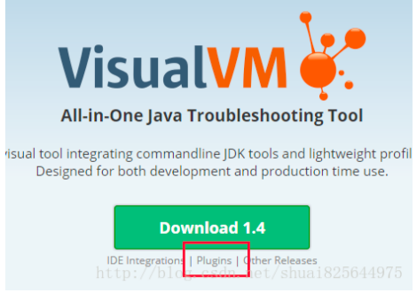
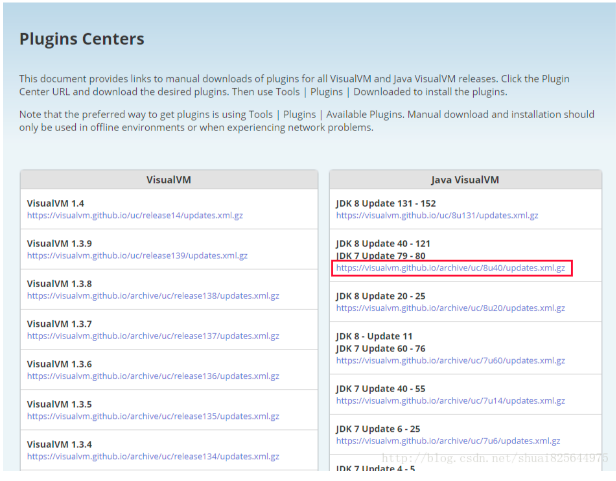
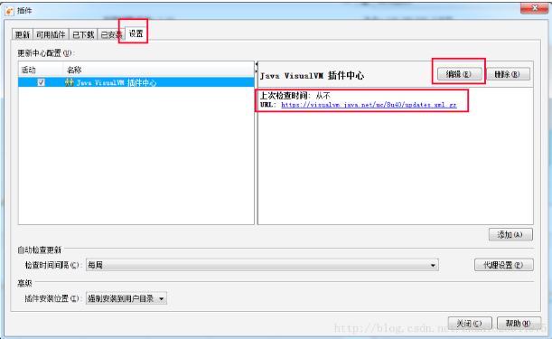
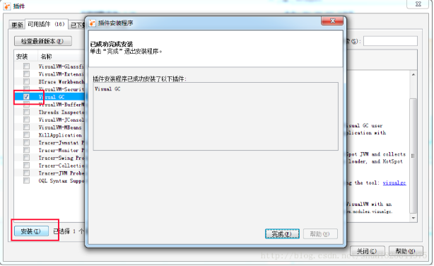
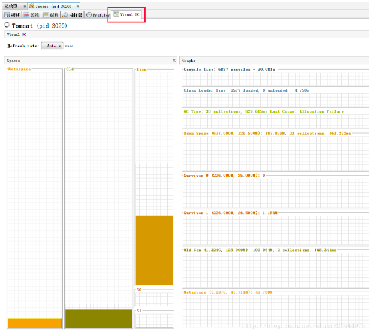

给jdk自带的jvisualvm安装Visual GC插件，遇到We're sorry the java.net site has
closed（我们很抱歉java.net网站已经关闭）

## 1、找到新的更新地址

visualvm新访问地址：https://visualvm.github.io/index.html

进入“Plugins”，找到对应自己JDK版本的更新地址

## 2、进入jvisualvm的插件管理

"工具" - "插件"
在"设置"中修改url地址为刚才我们在github上找到的对应我们JDK版本的地址

修改成功后，可用插件即可刷新出来

## 3、安装VisualGC插件

## 4、重启即可看到VisualGC

一：整个区域分为三部分：spaces、graphs、histogram

### 1，spaces区域：

代表虚拟机内存分布情况。从图中可以看出，虚拟机被分为Perm、Old、Eden、S0、S1

注意：如果对每个区域基本概念不是很熟悉的可以先了解下java虚拟机运行时数据区这篇
文字。

#### 1.1）perm：

英文叫做Permanent Generation，我们称之为永久代。(根据深入java虚拟
机作者说明，这里说法不是不是很正确，因为hotspot虚拟机的设计团队选择把GC分代收
集扩展至此而已，正确的应该叫做方法区或者非堆)。

##### 1.1.1）

通过VM Args:-XX:PermSize=128m -XX:MaxPermSize=256m 设置初始值与最
大值

#### 1.2）heap：

java堆(java heap)。它包括老年代(图中Old区域)和新生代(图中Eden/S0/S1
三个统称新生代，分为Eden区和两个Survivor区域)，他们默认是8:1分配内存

##### 1.2.1）通过VM Args:

-xms512m -Xmx512m -XX:+HeapDumpOnOutofMemoryError
-Xmn100m -XX:SurvivorRatio=8 设置初始堆内存、最大堆内存、内存异常打印dump、
新生代内存、新生代内存分配比例(8:1:1)，因为Heap分为新生代跟老年代，所以512M-
100M=412M，老年代就是412M(初始内存跟最大内存最好相等，防止内存不够时扩充内
存或者Full GC，导致性能降低)

### 2，Graphs区域：内存使用详细介绍

#### 2.1）Compile Time(编译时间)：

6368compiles 表示编译总数，4.407s表示编译累计
时间。一个脉冲表示一次JIT编译，窄脉冲表示持续时间短，宽脉冲表示持续时间长。

#### 2.2）Class Loader Time(类加载时间):

20869loaded表示加载类数量, 139 unloaded
表示卸载的类数量，40.630s表示类加载花费的时间

#### 2.3）GC Time(GC Time)：

2392collections表示垃圾收集的总次数，37.454s表示垃圾
收集花费的时间，last cause表示最近垃圾收集的原因

#### 2.4）Eden Space(Eden 区)：

括号内的31.500M表示最大容量，9.750M表示当前容
量，后面的4.362M表示当前使用情况，2313collections表示垃圾收集次数，8.458s表示垃
圾收集花费时间

#### 2.5）Survivor 0/Survivor 1(S0和S1区)：

括号内的3.938M表示最大容量，1.188M表示
当前容量，之后的值是当前使用情况

#### 2.6）Old Gen(老年代)：

括号内的472.625M表示最大容量，145.031M表示当前容量，
之后的87.031表示当前使用情况，79collections表示垃圾收集次数 ，28.996s表示垃圾收
集花费时间

#### 2.7）Perm Gen(永久代)：

括号内的256.000M表示最大容量，105.250M表示当前容
量，之后的105.032M表示当前使用情况

### 3，Histogram区域：

survivor区域参数跟年龄柱状图

#### 3.1）Tenuring Threshold：

表示新生代年龄大于当前值则进入老年代

#### 3.2）Max Tenuring Threshold：

表示新生代最大年龄值。

#### 3.3）Tenuring Threshold与Max Tenuring Threshold区别：

Max Tenuring
Threshold是一个最大限定，所有的新生代年龄都不能超过当前值，而Tenuring
Threshold是个动态计算出来的临时值，一般情况与Max Tenuring Threshold相等，如果
在Suivivor空间中，相同年龄所有对象大小的总和大于Survivor空间的一半，则年龄大于或
者等于该年龄的对象就都可以直接进入老年代(如果计算出来年龄段是5，则Tenuring
Threshold=5，age>=5的Suivivor对象都符合要求)，它才是新生代是否进入老年代判断的
依据。

#### 3.4）

Desired Survivor Size：
Survivor空间大小验证阙值(默认是survivor空间的一
半)，用于Tenuring Threshold判断对象是否提前进入老年代。

#### 3.5）

Current Survivor Size：
当前survivor空间大小

#### 3.6）

histogram柱状图：
表示年龄段对象的存储柱状图

#### 3.7）

如果显示指定-XX:+UseParallelGC --新生代并行、老年代串行收集器 ，则histogram柱状图不支持当前收集器

## 引用：

https://www.oracle.com/java/technologies/visual-garbage-collection-monitoring-tool.html

https://www.oracle.com/java/technologies/javase/vmoptions-jsp.html